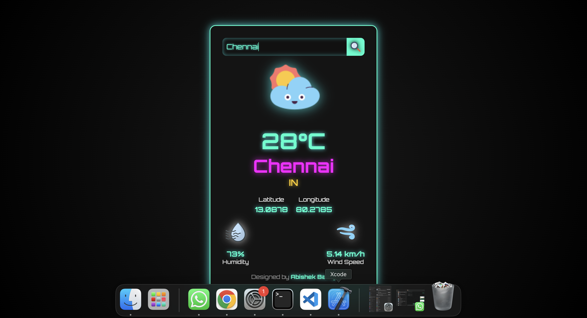

# Weather App

A simple weather application that provides real-time weather updates based on user input. Built using React and the OpenWeatherMap API.

## Features
- Fetch real-time weather data for any city
- Displays temperature, humidity, wind speed, latitude, and longitude
- Shows weather icons based on current conditions
- Background weather effects (rain or snow) depending on the weather condition
- Search functionality with `Enter` key support
- Error handling for invalid city searches

## Technologies Used
- React.js
- OpenWeatherMap API
- CSS for styling

## Installation

1. Clone the repository:
   ```sh
   git clone https://github.com/yourusername/weather-app.git
   ```
2. Navigate to the project directory:
   ```sh
   cd weather-app
   ```
3. Install dependencies:
   ```sh
   npm install
   ```
4. Start the application:
   ```sh
   npm start
   ```

## Configuration

1. Get your API key from [OpenWeatherMap](https://openweathermap.org/api).
2. Replace the `api_Key` value in `App.js` with your API key:
   ```js
   const api_Key = "your_api_key_here";
   ```

## Project Structure
```
weather-app/
│── src/
│   ├── assets/             # Weather icons and images
│   ├── components/
│   │   ├── WeatherEffect.js # Handles background effects
│   │   ├── WeatherDetails.js # Displays weather information
│   ├── App.js              # Main component
│   ├── App.css             # Styling
│   ├── index.js            # Entry point
│── public/
│── package.json
│── README.md
```



## Usage
1. Enter a city name in the search bar.
2. Press `Enter` or click the search icon.
3. View real-time weather details.

## License
This project is open-source and available under the [MIT License](LICENSE).

## Author
Designed and Developed by **Abishek Balraj**.

## Contact
For any queries, contact:
- 📞 9150313132
- 📧 abishekar2000@gmail.com

